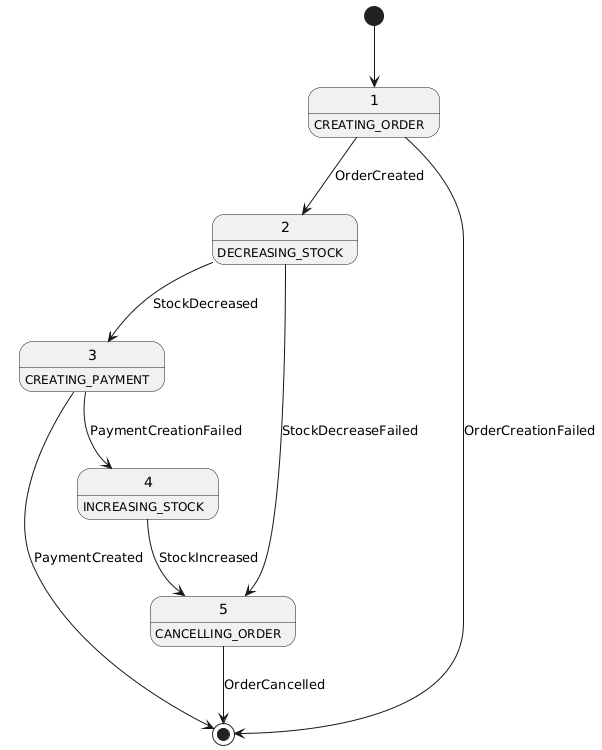
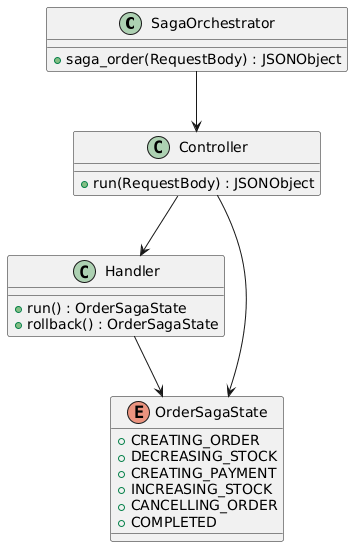
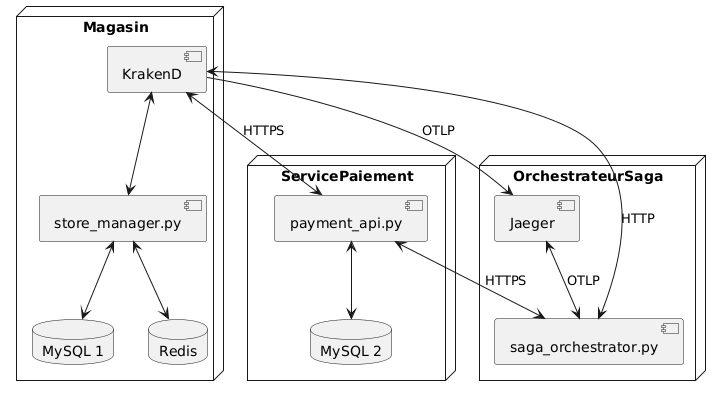

# Orchestrateur Saga - Documentation d'Architecture

Ce document, basé sur le modèle arc42, décrit l'orchestrateur saga pour la gestion des commandes travaillant en tandem avec Store Manager and Payments API.

## 1. Introduction et Objectifs

### Panorama des exigences
L'orchestrateur saga est une application qui coordonne les transactions distribuées lors de la création d'une commande dans le Store Manager. Il garantit la cohérence des données à travers plusieurs services en gérant une séquence d'opérations et leurs compensations en cas d'échec.

Fonctionnalités principales :
- Orchestration de la création de commandes, de la gestion des stocks qui s'ensuit et du paiement lié à la création d'une nouvelle commande
- Compensation automatique en cas d'erreur (rollback)

### Objectifs qualité
| Priorité | Objectif qualité | Scénario |
|----------|------------------|----------|
| 1 | **Cohérence des données** | Garantir que toutes les opérations d'une commande réussissent ou qu'aucune ne soit appliquée |
| 2 | **Résilience** | Capacité à compenser les opérations en cas d'échec partiel |
| 3 | **Maintenabilité** | Architecture extensible et ségrégué permettant d'ajouter facilement de nouvelles étapes au saga |

### Parties prenantes (Stakeholders)
- **Développeuses et développeurs** : Apprendre/enseigner le patron saga pour les transactions distribuées
- **Store Manager** : Créer des commandes de manière fiable
- **Payments API** : Fournir un service de paiement pour les commandes de manière fiable

## 2. Contraintes d'architecture

| Contrainte | Description |
|------------|-------------|
| **Technologie** | Utilisation de Python 3, Flask et Docker |
| **Architecture** | Patron Saga avec orchestration centralisée |
| **Intégration** | Doit s'intégrer avec les applications Store Manager et Payments API existantes |

## 3. Portée et contexte du système

### Contexte métier

L'orchestrateur saga coordonne le processus de création de commande (Order Saga) qui implique :
1. Création de la commande dans le Store Manager
2. Gestion du stock pour les articles commandés
3. Traitement du paiement
4. Compensation en cas d'échec à n'importe quelle étape

### Contexte technique
- **Applications clientes** : Postman, potentiels frontends web/mobiles
- **Services impliqués** : StoreManager, PaymentsAPI
- **Machine à états** : Utilisation des états pour répresenter et gérer la progression d'une saga
- **Communication** : Appels HTTP REST vers l'API StoreManager

## 4. Stratégie de solution

| Problème | Approche de solution |
|----------|---------------------|
| **Transactions distribuées** | Patron Saga avec orchestration centralisée |
| **Compensation d'erreurs** | Méthodes `rollback()` dans chaque commande |
| **Séquencement d'opérations** | Machine à états avec transitions explicites et sans boucles |
| **Uniformité** | Utilisation de méthodes abstraites dans les classe Handler et Controller pour garantir l'uniformité des implementations |

## 5. Vue des blocs de construction

## 6. Vue d'exécution

## 7. Vue de déploiement

## 8. Concepts transversaux
Patron Saga, Machine à états

## 9. Décisions d'architecture
Veuillez consulter le fichier `/docs/adr/adr001.md`.

## 10. Exigences qualité

### Cohérence des données
- Toutes les opérations d'une commande réussissent ou aucune n'est appliquée
- Les rollbacks restaurent l'état précédent du système

### Résilience
- Gestion des erreurs à chaque étape des sagas
- Compensation automatique en cas d'échec partiel

### Maintenabilité
- Séparation claire des responsabilités (Controller, Handlers, États)
- Structure extensible permettant d'ajouter facilement de nouvelles étapes

## 11. Risques et dettes techniques

| Risque | Impact | Stratégie de mitigation |
|--------|--------|------------------------|
| **Point de défaillance unique** | Si l'orchestrateur cesse de fonctionner, il devient impossible de créer des commandes, même si le Store Manager et le Payments API continuent de fonctionner | Coupler l'orchestrateur avec le Store Manager, ou utiliser une saga chorégraphiée (nous allons faire ça dans le labo 8) |
| **Absence de mécanisme de retry** | Échec définitif en cas d'erreur temporaire, car l'état de la machine à états n'est conservé qu'en mémoire | Implémenter une logique de persistence de l'état actuel de l'instance de l'orchestrateur pour permettre un retry automatique (nous n'allons pas implémenter ça dans ce labo, mais c'est une amélioration à considérer pour le futur) |

## 12. Glossaire

| Terme | Définition |
|-------|------------|
| **Saga** | Un algorithme capable de coordonner plusieurs changements d'état, mais qui évite de bloquer les ressources pendant de longues périodes |
| **Orchestration** | Coordination centralisée d'un processus métier complexe |
| **Compensation** | Opération inverse permettant d'annuler les effets d'une opération précédente |
| **Handler** | Dans le patron de conception «Chain of Responsibility», chaque handler stocke une référence vers le prochain handler de la chaîne. En plus de traiter la demande, les handlers la font passer plus loin dans la chaîne. |
| **Rollback** | Annulation d'une opération pour restaurer un état précédent |
| **Machine à états** | Modèle de calcul composé d'états et de transitions entre ces états |